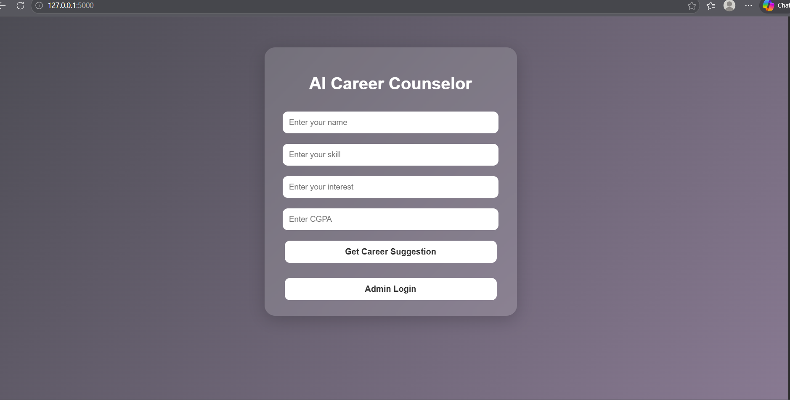
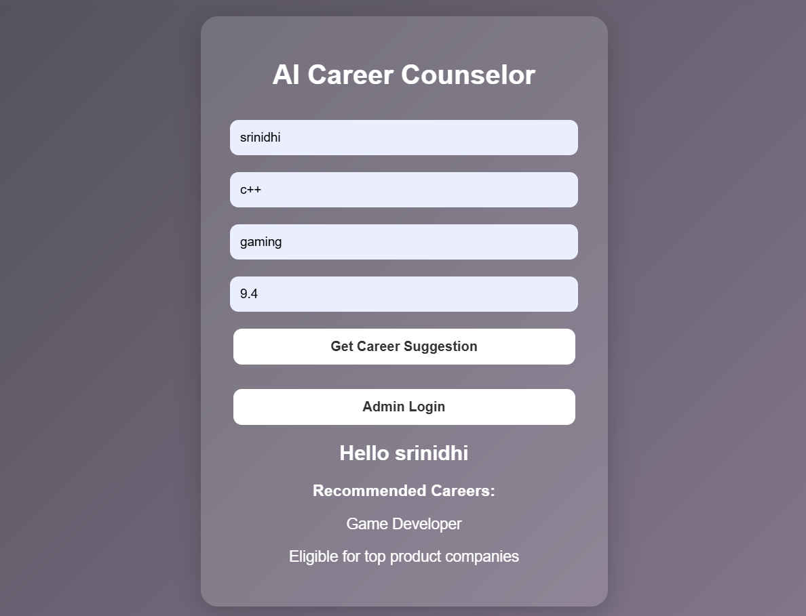
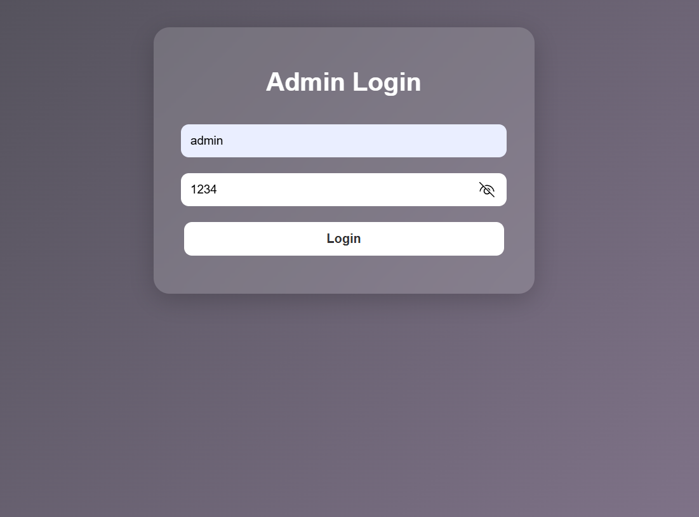
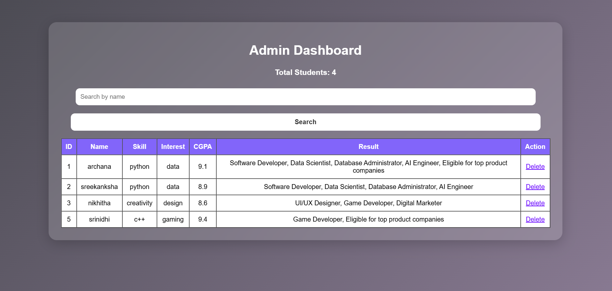

# AI Career Counselor for Students

A Flask-based web application that recommends suitable career paths based on students' skills, interests, and CGPA.

## Technologies Used
- Python
- Flask
- HTML
- CSS
- SQLite

## Features
- Smart Career Recommendations
- Student Input Form
- Admin Login Panel
- Student Records Dashboard
- Search and Delete Records
- Clean User Interface

## Screenshots

### Home Page

### Career Result Page

### Login Page

### Dashboard

## How to Run Project

1. Install Python  
2. Install Flask using `pip install flask`  
3. Run `python app.py`  
4. Open browser and go to `http://127.0.0.1:5000`

## Future Enhancements
- Machine Learning Recommendations
- Resume Analyzer
- Chatbot Career Guidance
- Mobile Application
